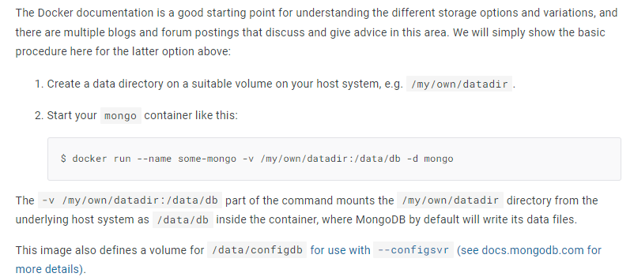

[< Backward](../README.md)

# Demo Application

## 1. MongoDB Docker

```
# Host node.js connect Dockerized Mongo
docker run --name test-mongo -d --rm -p 27017:27017 mongo

# Dockerized node.js connect Dockerized Mongo
docker run --name test-mongo -d --rm mongo
```

## 2. Steps

1. Host node.js will connect Dockerized mongo.
2. Dockerized node.js will connect Dockerized mongo.
3. Dockerized react.js spa will connect Dockerized node.js
4. Use Network to connect among Isolated Containers.
5. Use volume to make Mongo as a persistant.
6. Use security option to make Mongo more secure.

### 2.1. Host node.js will connect Dockerized mongo.

```sh
cd ~/backend
npm ci

docker run --name test-mongo -d --rm -p 27107:27017 mongo

node app.js
```

### 2.2. Dockerized node.js will connect Dockerized mongo.

1. Create Dockerfile
2. Update app.js
3. Build images and run using it.

- 2.2.1. Create Dockerfile

```Dockerfile
FROM node:14

WORKDIR /app

COPY package.json /app
COPY package-lock.json /app

RUN npm ci

COPY . /app

EXPOSE 80

CMD ["node", "app.js"]
```

- 2.2.2. Update app.js

```js
// Before
mongoose.connect(
    `mongodb://127.0.0.1:27017/course-goals`,
    { /* Options */ },
    () => { /* Callbacks */ }
);

// After
const MONGO_URL = 'host.docker.internal';
mongoose.connect(
    `mongodb://${MONGO_URL}:27017/course-goals`,
    { /* Options */ },
    () => { /* Callbacks */ }
);
```

- 2.2.3. Build images and run using it.

```sh
# require ["2.1."]
docker build -t test-backend:beta .


docker run --name test-backend -d --rm -p 80:80 test-backend:beta
    # -p HOST_PORT:DOCKERIZED_PORT
```

### 2.3. Dockerized react.js spa will connect Dockerized node.js

- 2.3.1. Create Dockerfile

```Dockerfile
FROM node:14

WORKDIR /app

COPY package-lock.json /app

RUN npm ci

COPY . /app

CMD ["npm", "start"]
```

- 2.3.2. Build images and run using it

```sh
# require ["2.1.", "2.2."]
docker build -t test-frontend:beta .

docker run --name test-frontend -d --rm -p 3000:3000 -it test-frontend:beta
    # -it : if you don't add -it(interactive mode) with react application, you can't run react container.
    
docker run --name test-backend -d --rm -p 3000:80 test-backend:beta
```

### 2.4. Use Network to connect among Isolated Containers.

- 2.4.1. Create docker network

```sh
docker network create test-network
```

- 2.4.2. Rebuild node application

```js
// Before
const MONGO_URL = 'host.docker.internal';

// After
const MONGO_URL = 'test-mongo';
```

```sh
cd ~/backend
docker build -t test-backend:beta .
```

- 2.4.3. Restart all container

```sh
docker run --name test-mongo    --network test-network -d --rm mongo
docker run --name test-backend  --network test-network -p 80:80 -d --rm test-backend:beta
docker run --name test-frontend -p 3000:3000 -d --rm -it test-frontend:beta
```

### 2.5. Use volume to make Mongo as a persistant.

```sh
docker run --name test-mongo    --network test-network -v test-mongo-data:/data/db --rm -d mongo
```

P.S. Why we're using Volume? Not Bind Mounts.



In [Official Documents of Mongo](https://hub.docker.com/_/mongo), use `Bind Mounts` to persist data.<br>
This method is good for testing mongo database.

But, generally just `Volume` is enough to perstat data.

### 2.6. Use security option to make Mongo more secure.

- 2.6.1. Update backend
```js
// Before
const MONGO_URL = 'test-mongo';

mongoose.connect(
    `mongodb://${MONGO_URL}:27017/course-goals`,
    { /* Options */ },
    () => { /* Callbacks */ }
);

// After
const MONGO_URL = 'test-mongo';
const MONGO_USERNAME = 'unchap_name';
const MONGO_PASSWORD = 'unchap_pwd';

const MONGO_AUTH = `${MONGO_USERNAME}:${MONGO_PASSWORD}@${MONGO_URL}`;

mongoose.connect(
    `mongodb://${MONGO_AUTH}:27017/course-goals`,
    { /* Options */ },
    () => { /* Callbacks */ }
);
```

- 2.6.2. Restart mongo

```sh
docker run --name test-mongo    --network test-network --rm -d \
    -v test-mongo-data:/data/db \
    -e MONGO_INITDB_ROOT_USERNAME=unchap_name \
    -e MONGO_INITDB_ROOT_PASSWORD=unchap_pwd \
    mongo
```

- 2.6.3. Rebuild and Restart node.js application

```sh
cd ~/backend

docker build -t test-backend:beta .

docker run --name test-backend  --network test-network -p 80:80 -d --rm test-backend:beta
```

### 2.7. Use volume to make Node as a persistant.
    
```sh
docker run \
    --name test-backend \
    --network test-network \
    -d -p 80:80 \
    --rm \
    -v test-backend-logs:/app/logs \
    -v /mnt/c/Kevin/Practice-Docker/Tutorial/4_Multi_Container_Apps/1_Demo_Applications/backend:/app \
    -v /app/node_mdules \
    test-backend:beta
```

### 2.8. Use nodemon to update with volume to make Node as synchorized with host files.

- Install and setup nodemon

```json
"scripts": {
    "start": "nodemon app.js"
},

"devDependencies": {
    "nodemon": "^2.0.4"
}
```

- Update Dockerfile

```Dockerfile
# Before
CMD ["node", "app.js"]

# After
CMD ["npm", "start"]
```

- Rebuild and restart node application

```sh
cd ~/backend

docker build -t test-backend:beta .

docker run \
    --name test-backend \
    --network test-network \
    -d -p 80:80 \
    --rm \
    -v test-backend-logs:/app/logs \
    -v /mnt/c/Kevin/Practice-Docker/Tutorial/4_Multi_Container_Apps/1_Demo_Applications/backend:/app \
    -v /app/node_mdules \
    test-backend:beta
```